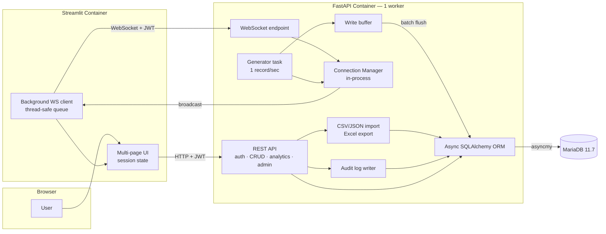

# Architecture

Realtime Data Analytics & Monitoring System — approved architecture for this assignment.

## System Overview

A single monorepo containing two services plus a database, orchestrated by Docker Compose and started with `docker compose up --build`.

- **Backend (FastAPI)** — the only component that talks to the database. Exposes REST for authentication, CRUD, analytics and administration, and a WebSocket endpoint for realtime push. A background task generates one simulated data point per second.
- **Frontend (Streamlit)** — a multi-page interactive UI. Reaches the backend exclusively over REST and WebSocket; it never opens a database connection.
- **Database (MariaDB 11.7)** — accessed only through async SQLAlchemy ORM with `asyncmy`. No raw SQL for business data. Schema managed by Alembic.

Realtime delivery and persistence are decoupled: generated data is broadcast immediately, and written to MariaDB in batches.

## Mermaid Architecture Diagram

## Component Responsibilities

| Component          | Responsibility                                                                                                                                                                                                                              |
| ------------------ | ------------------------------------------------------------------------------------------------------------------------------------------------------------------------------------------------------------------------------------------- |
| FastAPI REST layer | Registration, login, token issuance; CRUD on data records; CSV/JSON import; analytics and Excel export; admin endpoints (users, roles, audit log, database status). Pydantic validation, HTTP error handling, Swagger docs, stdout logging. |
| WebSocket endpoint | Authenticates the connection, registers it with the connection manager, streams realtime records to subscribers.                                                                                                                            |
| Connection Manager | In-process registry of active WebSocket connections; fan-out broadcast; cleanup on disconnect.                                                                                                                                              |
| Generator task     | Async background task started in the app lifespan; emits one simulated record per second, marks threshold breaches, hands the record to the manager and the buffer.                                                                         |
| Write buffer       | Accumulates generated records; flushes via the ORM when `BATCH_SIZE` or `BATCH_INTERVAL_SECONDS` is reached, and on graceful shutdown.                                                                                                      |
| ORM / data access  | Async SQLAlchemy sessions over a managed connection pool; all queries and aggregations expressed as ORM constructs.                                                                                                                         |
| Alembic            | Schema versioning; migrations run as a separate step before the FastAPI application process starts.                                                                                                                                         |
| Streamlit app      | Login/logout, session state, data management pages, analytics charts and downloads, admin pages, and a live chart fed by the background WebSocket client.                                                                                   |

## Data Model

Three tables.

**`users`**
`id`, `username` (unique), `email` (unique), `hashed_password`, `role` (`ADMIN` / `USER` / `VIEWER`), `is_active`, `created_at`, `updated_at`.

**`data_records`** — one table for all data, distinguished by `source`.
`id`, `title`, `value`, `category`, `timestamp`, `source` (`MANUAL` / `IMPORT` / `REALTIME`), `is_anomaly`, `owner_id` (FK → `users.id`, nullable for `REALTIME`), `created_at`, `updated_at`.
Indexes on `timestamp`, `(category, timestamp)`, `(source, timestamp)`.

**`audit_logs`** — the queryable "system log".
`id`, `user_id` (FK → `users.id`, nullable for system actions), `action`, `resource_type`, `resource_id`, `detail`, `ip_address`, `created_at`.
Index on `created_at`.

## Realtime Data Flow

1. The generator task wakes once per second and produces a record (`source = REALTIME`), flagging `is_anomaly` when the value crosses the configured threshold.
2. The record is handed to the connection manager and broadcast immediately to every connected client as JSON.
3. The same record is appended to the in-memory write buffer.
4. When the buffer holds `BATCH_SIZE` records (default 10) or `BATCH_INTERVAL_SECONDS` has elapsed (default 5), the buffer flushes through the ORM in a single transaction.
5. The buffer flushes on graceful shutdown.
6. Persisted realtime records are afterwards queryable through the normal REST endpoints, filtered by `source`.

Broadcast never waits on the database, so a slow write cannot delay realtime delivery.

## REST vs WebSocket

|               | REST                                                            | WebSocket                                                                                                                             |
| ------------- | --------------------------------------------------------------- | ------------------------------------------------------------------------------------------------------------------------------------- |
| Used for      | Authentication, CRUD, import, analytics, export, administration | Server-initiated push of generated realtime records                                                                                   |
| Direction     | Client-initiated request/response                               | Server → client stream                                                                                                                |
| Auth          | `Authorization: Bearer <JWT>`                                   | JWT is validated when establishing the WebSocket connection. The concrete token transport mechanism is defined during implementation. |
| Documented in | Swagger / OpenAPI                                               | This document (WebSocket is outside the OpenAPI schema)                                                                               |

The client never sends data upstream over the WebSocket; all writes go through REST.

## Authentication and RBAC

JWT bearer tokens issued at login and verified on every REST request and WebSocket handshake. Passwords are stored hashed.

Three roles:

| Capability                      | Admin      | User             | Viewer |
| ------------------------------- | ---------- | ---------------- | ------ |
| Read records, analytics, export | ✅         | ✅               | ✅     |
| Subscribe to realtime WebSocket | ✅         | ✅               | ✅     |
| Create records / import         | ✅         | ✅               | ❌     |
| Update / delete records         | Any record | Own records only | ❌     |
| User list, role changes         | ✅         | ❌               | ❌     |
| Audit log, database status      | ✅         | ❌               | ❌     |

Self-registration always yields the `USER` role; the role field is not accepted from the public registration endpoint. The initial Admin is seeded at startup. Only an Admin can promote or demote users between `ADMIN`, `USER` and `VIEWER`.

## Key Design Decisions

1. **Single `DataRecord` table with a `source` field** — manual, imported and realtime data share one schema and one set of CRUD, analytics and export endpoints. `source` provides separation where it is needed.
2. **Realtime delivery decoupled from persistence** — immediate broadcast, batched writes. Keeps the one-second tick independent of database latency.
3. **Configurable batch flush** — `BATCH_SIZE` / `BATCH_INTERVAL_SECONDS` (defaults 10 / 5) via environment variables, so the delivery/durability balance is tunable without code changes.
4. **In-process connection manager, one FastAPI worker** — the simplest correct design for a single-instance deployment; avoids a broker for realtime fan-out.
5. **Streamlit as a pure API client** — no database driver in the frontend. One enforcement point for authorization and validation.
6. **ORM-only for business data** — all queries and aggregations are SQLAlchemy constructs. Alembic DDL, connection health checks and pool introspection are the explicit exceptions.
7. **Persisted `AuditLog` separate from runtime logs** — the Admin log-query feature reads a table; operational logs stream to stdout for `docker compose logs`.
8. **Streamlit realtime consumption** — a background WebSocket client thread feeding a thread-safe queue, drained by a controlled UI refresh, because Streamlit re-runs its script on every interaction and cannot hold a connection in script scope. Implemented in the realtime phase.

## Assumptions

- Registration is open; new accounts receive `USER`. One Admin account is seeded from environment variables.
- All authenticated roles may read all records; write scope is limited by ownership and role.
- Analytics and export operate over `data_records` with the same filters as the read endpoints, optionally narrowed by `source`.
- The anomaly threshold is supplied by configuration. A breach sets `is_anomaly` on the record and is visible in both the live stream and history; there is no separate alert table.
- Realtime records have no owner and draw from a small fixed set of categories; the stream is broadcast identically to all connected clients.
- JWT is maintained in Streamlit session state for the active user session. Persistent login across sessions is outside the assignment scope.
- Import accepts CSV and JSON, validates per row, and reports rejected rows back to the caller.
- Alembic migrations run before the FastAPI application starts, not inside the FastAPI lifespan. The backend starts only after MariaDB is healthy and migrations complete successfully.
- Timestamps are stored and compared in UTC.

## Trade-offs

- **Buffered writes trade durability for latency.** Up to `BATCH_SIZE` records (or one interval's worth) are lost if the process is killed without a graceful shutdown. Acceptable for simulated monitoring data.
- **One worker and an in-process manager mean no horizontal scaling.** A second worker would run a second generator and split the broadcast set. The backend is pinned to one worker.
- **A single `data_records` table** keeps the API surface small but mixes high-volume generated rows with low-volume user rows; indexes on `timestamp`, `(category, timestamp)` and `(source, timestamp)` carry the query load.
- **No retention policy.** Realtime data accumulates at ~86k rows/day, which is fine for the assignment's lifetime.
- **Streamlit's rerun model** makes realtime UI more involved than a JavaScript client would be, and refresh cadence is a deliberate compromise between smoothness and rerun cost.
- **Redis, Kafka, Celery, Kubernetes, distributed fan-out, HA and retention**
  are deliberately out of scope for this assignment and are discussed here
  only as production considerations.
